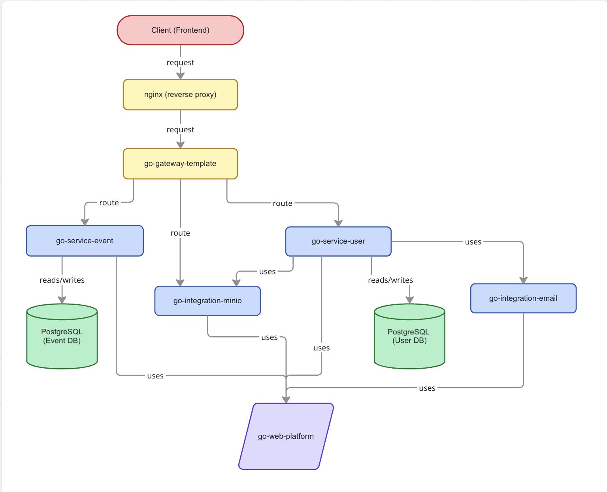
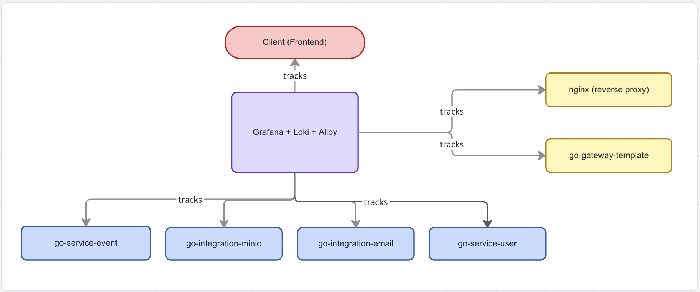

# Go Web Services — documentation

Central place for documentation spanning multiple Go web services in this organization. Each service keeps its own source repository; this repo holds cross-cutting notes and links.

## Combined architecture

How gateway, services, integrations, and the shared platform connect when repos are wired into one deployment:

## Services

| Service                                                                         | Documentation                                                |
| ------------------------------------------------------------------------------- | ------------------------------------------------------------ |
| [go-web-platform](https://github.com/go-web-services/go-web-platform)           | [docs/go-web-platform.md](docs/go-web-platform.md)           |
| [go-service-user](https://github.com/go-web-services/go-service-user)           | [docs/go-service-user.md](docs/go-service-user.md)           |
| [go-integration-email](https://github.com/go-web-services/go-integration-email) | [docs/go-integration-email.md](docs/go-integration-email.md) |
| [go-service-event](https://github.com/go-web-services/go-service-event)         | [docs/go-service-event.md](docs/go-service-event.md)         |
| [go-integration-minio](https://github.com/go-web-services/go-integration-minio) | [docs/go-integration-minio.md](docs/go-integration-minio.md) |
| [go-gateway-template](https://github.com/go-web-services/go-gateway-template)   | [docs/go-gateway-template.md](docs/go-gateway-template.md)   |
